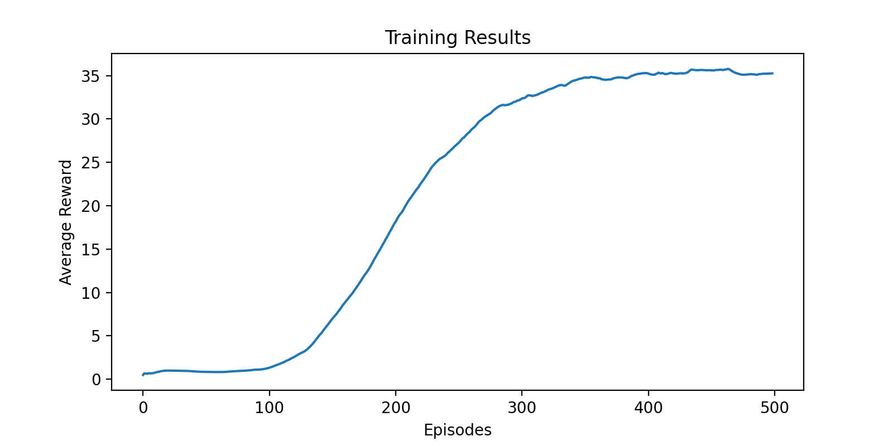
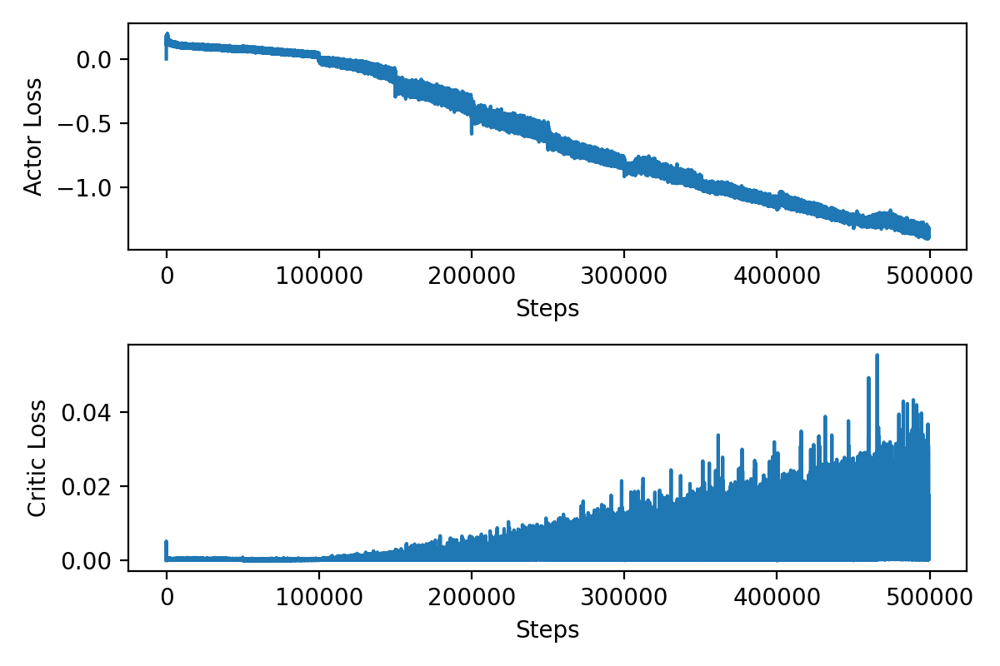

# Report

## The agent

A Deep Deterministic Policy Gradient (DDPG) agent is used to train the Reacher environment. DDPG agents can operate on continuous action spaces which is a critical requirement for this environment. 

During the training process, the agent interacts with the environment and stores experiences in an offline experience buffer. Learning from experiences is through a stochastic gradient descent process. The agent uses an actor-critic model, where the critic approximates the state-action value function Q(s,a) and the actor models a deterministic policy that maximizes the expected value of Q(s,a) as the training progresses.

Both the actor and critic are modeled by neural networks as explained in the following sections.

### Actor

The actor in a DDPG agent is a deterministic actor. It is modeled by a neural network that takes states as input and outputs the actions. In this implementation, the actor neural network has 2 fully connected layers with sizes 64 and 32. The output of the actor is bounded between -1 and 1 through a tanh layer. This network structure is simple and you will alter find that this is sufficient to train the agent.

```python
class DeterministicActor(nn.Module):
    
    def __init__(self, num_obs, num_act, seed=0):
        
        torch.manual_seed(seed)
        super(DeterministicActor, self).__init__()
        self.num_obs = num_obs
        self.device = torch.device('cuda:0' if torch.cuda.is_available() else 'cpu')
        
        # layers
        self.fc1 = nn.Linear(num_obs,64)
        self.fc2 = nn.Linear(64,32)
        self.fc3 = nn.Linear(32,num_act)
        self.tanh = nn.Tanh()
        
    def forward(self, state):
        
        x = F.relu(self.fc1(x))
        x = F.relu(self.fc2(x))
        x = self.tanh(self.fc3(x))
        return x
        
    def mu(self, state):
        
        return torch.clamp(self.forward(state), -1, 1)
        
```

During training, the agent explores the action space by introducing random exploration noise in its actions. This is performed by a noise model known as **Ornstein-Uhlenbeck action noise**, or more commonly, OU noise. The noise is parameterized by its mean, mean attraction constant and variance. The variance can be decayed to facilitate high exploration towards the beginning of training and exploitation later on.

```python
class OUNoise:
    
    def __init__(self, size, mean=0, mac=0.15, var=0.1, varmin=0.01, decay=1e-6, seed=0):
    
        np.random.seed(seed)
        self.mean = mean * np.ones(size)
        self.mac = mac
        self.var = var
        self.varmin = varmin
        self.decay = decay
        self.x = np.zeros(size) #0.25 * np.random.rand(20,4)
        self.xprev = self.x
        self.step_count = 0
        
    def step(self):
    
        r = self.x.shape[0]
        c = self.x.shape[1]
        self.x = self.xprev + self.mac * (self.mean - self.xprev) + self.var * np.random.randn(r,c)
        self.xprev = self.x
        dvar = self.var * (1-self.decay)
        self.var = np.maximum(dvar, self.varmin)
        self.step_count += 1
        return self.x

```

### Critic

The critic in DDPG approximates the state-value function Q(s,a). The critic neural network used in this implementation takes states and actions as inputs and outputs the Q-value of the state-action pair. The state and action inputs are passed through their own fully connected layer after which the inputs are concatenatied and passed through additional fully connected layers. 

```python
class QCritic(nn.Module):

    def __init__(self, num_obs, num_act, seed=0):
        
        torch.manual_seed(seed)
        super(QCritic, self).__init__()
        self.num_obs = num_obs

        # ------ layers ------
        
        # state path
        self.sfc1 = nn.Linear(num_obs,64)
        self.sfc2 = nn.Linear(64,64)
        
        # action path
        self.afc1 = nn.Linear(num_act,64)
        self.afc2 = nn.Linear(64,64)
        
        # common path
        self.cfc1 = nn.Linear(64*2,64)
        self.cfc2 = nn.Linear(64,1)

        
    def forward(self, state, action):
        
        # state path
        xs = F.relu(self.sfc1(s))
        xs = F.relu(self.sfc2(xs))
        
        # action path
        xa = F.relu(self.afc1(a))
        xa = F.relu(self.afc2(xa))
        
        # common path
        xc = torch.cat((xs,xa), dim=1)
        xc = F.relu(self.cfc1(xc))
        xc = self.cfc2(xc)

        return xc

    def Q(self, state, action):
        
        return self.forward(state, action)
        
```

## Learning algorithm

DDPG is a cross between value-based and policy gradient algorithms. The Q-Learning side of DDPG approximates the max Q-value of a state-action pair. The policy gradient side of DDPG uses the Q-function to learn the policy. The high level steps in the training algorithm is as follows:

* Sample experiences from the experience buffer.
* Train the critic by minimizing the TD-errors through stochastic gradient descent.
* Train the actor by maximizing the Q-function through gradient ascent.

The algorithm also uses target networks for the actor and critic which are their time-delayed copies. These target networks are updated at regular intervals and greatly stabilize the training process.

```python
def learn(self, experiences):
        
        # unpack experience
        states, actions, rewards, next_states, dones = experiences
        
        # normalize rewards
        #rewards = (rewards - np.mean(self.buffer.rew_buf)) / (np.std(self.buffer.rew_buf) + 1e-5)
        
        # compute td targets
        with torch.no_grad():
            target_action = self.target_actor.mu(next_states)
            targetQ = self.target_critic.Q(next_states,target_action)
            y = rewards + self.gamma * targetQ * (1-dones)
        
        # compute local Q values
        Q = self.critic.Q(states, actions)
        
        # critic loss
        critic_loss = torch.mean((y-Q)**2)

        # update critic
        self.critic_optimizer.zero_grad()
        critic_loss.backward()
        torch.nn.utils.clip_grad_norm_(self.critic.parameters(), 1)  # gradient clipping
        self.critic_optimizer.step()
        
        # freeze critic before policy loss computation
        for p in self.critic.parameters():
            p.requires_grad = False
        
        # actor loss
        actor_loss = -self.critic.Q(states, self.actor.mu(states)).mean()
        
        # update actor
        self.actor_optimizer.zero_grad()
        actor_loss.backward()
        torch.nn.utils.clip_grad_norm_(self.actor.parameters(), 1)  # gradient clipping
        self.actor_optimizer.step()
        
        # Unfreeze critic
        for p in self.critic.parameters():
            p.requires_grad = True
            
        # log the loss and noise
        self.actor_loss_log.append(actor_loss.detach().cpu().numpy())
        self.critic_loss_log.append(critic_loss.detach().cpu().numpy())
        self.noise_log.append(np.mean(self.noise_model.x))
        
        # soft update target actor and critic
        if self.step_count % self.update_freq == 0:
            self.soft_update(self.target_actor, self.actor)
            self.soft_update(self.target_critic, self.critic)
            
    
    def soft_update(self, target_model, model):
    
        with torch.no_grad():
            for target_params, params in zip(target_model.parameters(), model.parameters()):
                target_params.data.copy_(self.tau*params + (1-self.tau)*target_params.data)

```

## Hyperparameters
  
Following hyperparameters are used for the DDPG agent:
  
* The experience buffer length is 10^6, which is sufficient to store a large set of experiences.
* The actor and critic learn rates are set to 1e-4 and 1e-3 respectively.
* The target networks are updated by a small smoothing factor of 1e-3. This removes sudden changes and improves training convergence.
* The discount factor of 0.99 encourages long term rewards.
* The noise mean is set to 0 with mean attraction constant set to 0.2 and variance set to 0.05. The variance decays at the rate of 0.001 until a minimum threshold of 0.05 is reached. These noise parameters were crafted carefully so that they do not introduce too much exploration as well as decay to near zero after 500 episodes.

## Results

Following are plots from a sample training process. It is seen that the agent learns sufficiently to reach the average reward of +30 in 238 episodes. Training was continued until the average reward value converged to around +35. 



  
  
